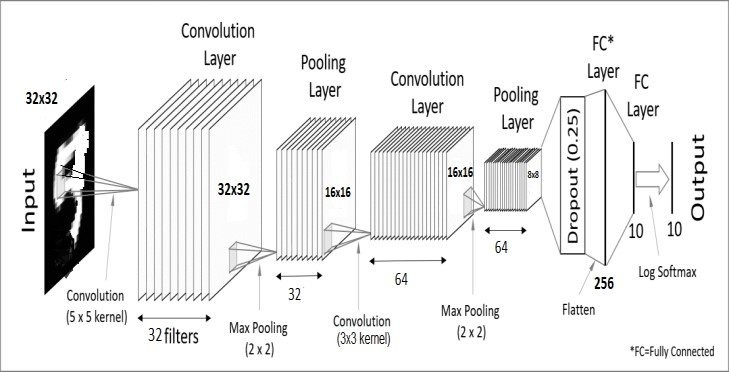
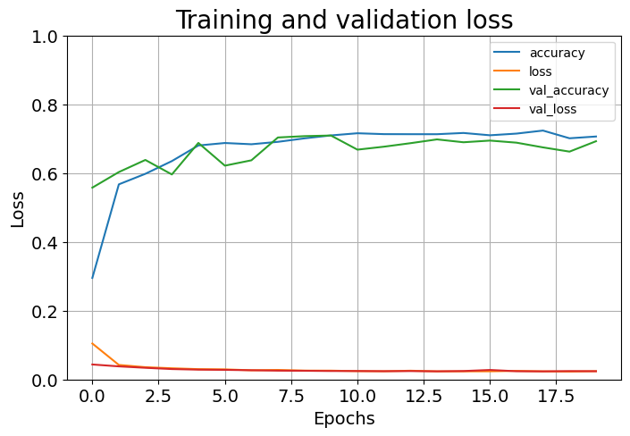

# Low-Light Image Enhancement using Deep Learning

## 🌟 Overview
This project focuses on enhancing low-light images using deep learning techniques. The model improves image clarity, reduces noise, and enhances visibility while preserving important details. The approach leverages convolutional neural networks (CNNs) and advanced image processing techniques to achieve superior enhancement results.

## 🚀 Features
- *Deep Learning-based Image Enhancement*: Uses CNN architectures to enhance low-light images.
- *Noise Reduction*: Effectively removes noise without losing details.
- *Contrast and Brightness Adjustment*: Improves overall image visibility.
- *End-to-End Processing Pipeline*: From input preprocessing to final image enhancement.
- *Customizable and Scalable*: Supports different datasets and configurations.

## 📂 Project Structure
```
├── dataset/                 # Contains training and testing datasets
├── models/                  # Pre-trained and trained models
├── src/                     # Source code for the implementation
│   ├── preprocessing.py     # Functions for image preprocessing
│   ├── train.py             # Training script for the model
│   ├── inference.py         # Image enhancement and testing
│   ├── utils.py             # Helper functions
├── results/                 # Output images after enhancement
├── notebooks/               # Jupyter notebooks for experimentation
├── requirements.txt         # Dependencies and required libraries
└── README.md                # Project documentation
```

## 🛠 Installation
1. Clone the repository:
   bash
   git clone [https://github.com/SouravGupta778/VisionX-Enhancing-vision-in-low-light-conditions-using-CNN.git]
   cd VisionX-Enhancing-vision-in-low-light-conditions-using-CNN.git
   
2. Install dependencies:
   bash
   pip install -r requirements.txt
   
3. Run the model on sample images:
   bash
   python inference.py --input path/to/image --output path/to/output
   

## 📊 Training the Model
To train the model with your dataset:
bash
python train.py --dataset path/to/dataset --epochs 50 --batch_size 16


## 📈 Results
Here are some sample results demonstrating the enhancement:
| Input Image | Enhanced Image |
|------------|---------------|
|  |  |

### Model Output
Below is a sample output generated by the model:



### Performance Graph
The graph below shows the model's training performance over epochs:



## 🔥 Future Improvements
- Implementation of Quantum-based enhancement techniques.
- Integration with real-time applications.
- Optimization for mobile and edge devices.

## 🤝 Contributing
Contributions are welcome! If you have ideas for improvements, feel free to open an issue or submit a pull request.

## 📜 License
This project is licensed under the MIT License.

---
📌 *Author:* Sourav Gupta  
📧 *Contact:* [souravrrr75@gmail.com]  
🔗 *GitHub:* [https://github.com/SouravGupta778]
